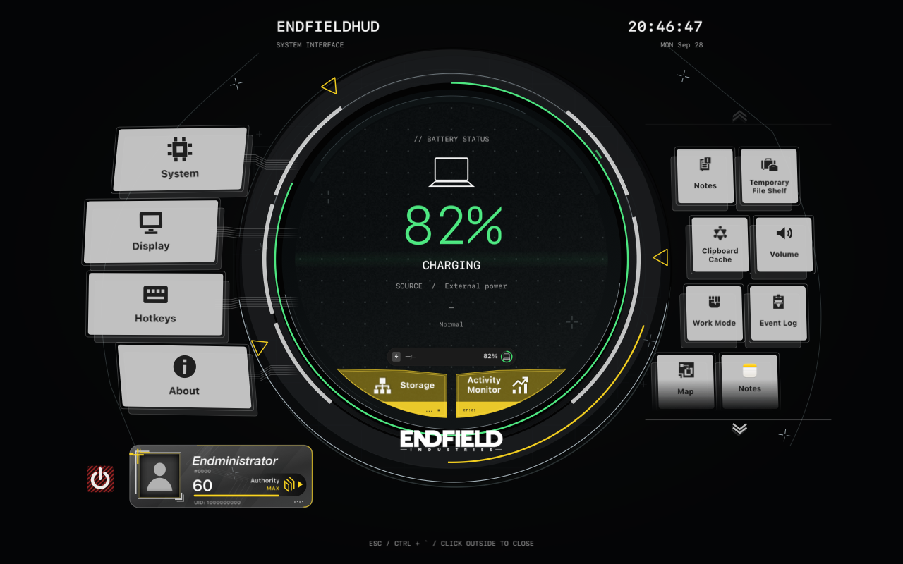
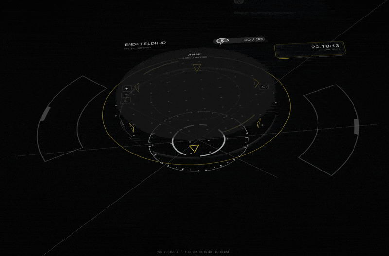
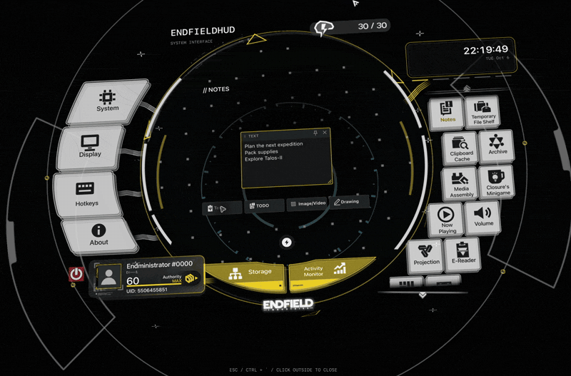

# EndfieldHUD

[English](README.md) · [简体中文](README.zh-CN.md) · [繁體中文](README.zh-TW.md) · [日本語](README.ja.md)

『アークナイツ：エンドフィールド』をモチーフにした macOS のメニューバーアプリです。ショートカットで立体的に動く HUD を開き、メモ、ファイルの一時置き、タイマー、音量調整、Mac の状態確認などを使えます。

**統合テスト用ブランチ：**新しい Watch の外観に、安定版 1.0.1 の機能と保存データ形式を組み合わせています。このブランチを試すには、[このブランチの成功した Build and test 実行](https://github.com/DDDuoDuo/EndfieldHUD/actions/workflows/build.yml?query=branch%3Acodex%2Fendfield-hud-integration)から **EndfieldHUD-macOS-…** アーティファクトをダウンロードしてください。以下のリリースへのリンクとプレビューは安定版のもので、このブランチのものではありません。

**[v1.0.1 をダウンロード — EndfieldHUD-1.0.1-build11-macOS.dmg](https://github.com/DDDuoDuo/EndfieldHUD/releases/download/v1.0.1/EndfieldHUD-1.0.1-build11-macOS.dmg)** · [すべてのリリース](https://github.com/DDDuoDuo/EndfieldHUD/releases)

*以下のプレビューは、実際のアプリにデモ用の内容とサンプルの数値を表示したものです。個人のメモ、クリップボード履歴、ファイルは含まれていません。*

## インストール

1. 上の DMG をダウンロードします。旧バージョンが起動している場合は、メニューバーから終了します。
2. DMG を開き、**EndfieldHUD.app** を **Applications（アプリケーション）** にドラッグします。
3. ディスクイメージを取り出し、「アプリケーション」から EndfieldHUD を開きます。メニューバーにアイコンが表示されます。
4. **Ctrl + バッククォート（`）** で HUD を開きます。

このリリースは **ad hoc 署名で、Apple の公証を受けていません**。開発元を確認できないという理由で macOS にブロックされた場合は、まずインストール済みのアプリを一度開いてください。このダウンロード元を信頼する場合は、**システム設定 → プライバシーとセキュリティ → このまま開く**で EndfieldHUD を個別に許可し、確認します。古い macOS では「システム環境設定 → セキュリティとプライバシー」を使います。Gatekeeper を無効にする必要はありません。[Apple の手順](https://support.apple.com/ja-jp/102445)

**Apple シリコンでは macOS 11 以降**、**Intel では macOS 10.15.4 以降**を対象にビルドしています。一部の機能には、より新しい macOS が必要です。主な動作確認環境は macOS 15.7.4 の M2 MacBook Air で、ほかの機種や古い OS での検証は限られています。

## 使い始める

- **開く・隠す：**Ctrl + バッククォート、またはメニューバーの **HUDを開く**を使います。Esc は編集中の項目や選択を先に閉じ、その後 HUD を閉じます。
- **画面を切り替える：**左右のボタンを使います。右側の一覧はスクロールできます。ストレージとアクティビティモニタは中央下、プロフィールは左下のカードから開きます。
- **言語を選ぶ：** **システム → 言語**を開くと、現在の選択にチェックが付いた一覧が表示されます。**システムに合わせる、English、简体中文、繁體中文、日本語**から選べます。4 言語に対応し、選択はすぐに反映されます。[言語選択](docs/media/languages.png)・[日本語の画面](docs/media/japanese.png)
- **見た目を変える：**「表示」で大きさ、位置、色、テーマ、ぼかし、遠近感、視差効果を調整できます。「ショートカット」では HUD を呼び出すキーを変更できます。
- **アプリを終了する：**メニューバーの **EndfieldHUDを終了**を選ぶか、プロフィールカード横の赤いボタンを押して確認します。HUD を隠しただけでは、アプリは終了しません。

開閉、傾き、画面切り替えの動きを見る

HUD の開閉と、マウスに合わせた傾き：

機能画面の切り替え：

## 機能一覧

各プレビューから画面を確認できます。機能名のリンクには詳しい使い方があります。

| 画面 | できること | プレビュー |
| --- | --- | --- |
| 電源 | 取得できるバッテリー残量や充電状態を表示します。主画面とは別の充電通知も使えます。 | [電源](docs/media/overview.png) |
| [メモ](docs/notes-canvas.md) | テキスト、チェックリスト、画像を追加。カードの移動・サイズ変更や、別の HUD 画面へのピン留めができます。 | [メモ](docs/media/notes.png) |
| [一時ファイルシェルフ](docs/file-shelf.md) | ファイルやフォルダを置き、プレビューして、まとめてドラッグできます。シェルフから削除しても元のファイルは残ります。 | [ファイルシェルフ](docs/media/shelf.png) |
| [クリップボード](docs/clipboard-cache.md) | 最近コピーしたテキスト、リンク、画像、ファイルを再利用し、よく使う項目をピン留めできます。履歴はアプリ終了時に消えます。 | [クリップボード](docs/media/clipboard.png) |
| [音量](docs/audio-and-work-mode.md) | 音声デバイスを選び、対応する音量・ミュート・左右バランスを調整します。アプリ別音量は実験的な機能で、macOS 14.2 以降が必要です。 | [音量](docs/media/volume.png) |
| [作業モード](docs/audio-and-work-mode.md#work-mode) | カウントダウンとストップウォッチ。5・30・60 分のプリセットと自由な時間設定に対応し、HUD を隠しても続きます。 | [作業モード](docs/media/work-mode.png) |
| [イベントログ](docs/event-log.md) | タイマー、ファイルシェルフの操作、デバイスの変化など、HUD のローカルイベントを確認・絞り込みできます。 | [イベントログ](docs/media/event-log.png) |
| [ストレージ](docs/storage-and-activity.md#storage) | 使用済み容量と空き容量を確認・更新し、macOS のストレージ設定を開けます。 | [ストレージ](docs/media/storage.png) |
| [アクティビティモニタ](docs/storage-and-activity.md) | CPU、メモリ、ネットワーク、ディスクのグラフと、並べ替えできるアプリ一覧を表示します。取得できない値はダッシュになります。 | [アクティビティ](docs/media/activity.png) |
| [+ アプリを追加](docs/app-shortcuts.md) | インストール済みアプリへのショートカットを保存。名前とアイコンを変え、HUD から起動できます。 | [アプリのショートカット](docs/media/apps.png) |
| [プロフィール](docs/personal-profile.md) | 名前、画像、背景、紹介文、日付を編集し、作業モードの累計時間を確認できます。 | [プロフィール](docs/media/profile.png) |
| [マップ](docs/map.md) | オフラインの地球地図を移動・拡大し、ピンを追加できます。位置情報は使わず、街路地図も読み込みません。 | [マップ](docs/media/map.png) |
| システム | 言語、表示先のディスプレイ、ログイン時の起動などを設定します。 | [言語選択](docs/media/languages.png) |
| 表示 | 見た目、アプリ・メニューバーのアイコン、バッテリー通知を設定します。大きさと位置の変更は、時間内に確認しなければ元に戻ります。 | [設定](docs/media/settings.png) |
| ショートカット | HUD を呼び出す新しいキーの組み合わせを登録します。 | [設定](docs/media/settings.png) |
| このアプリについて | バージョンとクレジットの確認、更新のチェック、自動インストールの設定ができます。 | [設定](docs/media/settings.png) |

## 権限とローカルデータ

| 機能 | 必要なもの |
| --- | --- |
| アプリ別音量 | **macOS 14.2 以降**と、機能を有効にするときの**システムオーディオ録音**の許可。音声はメモリ上で処理し、保存しません。対応デバイスには制限があります。[音量ガイド](docs/per-app-audio.md)・[Apple の権限ガイド](https://support.apple.com/en-in/guide/mac-help/mchl2844ecab/mac) |
| ファイルと画像 | 自分で選ぶ、貼り付ける、ドロップする項目へのアクセス。シェルフは参照を保持し、画像メモとプロフィール画像はローカルにコピーを保存します。 |
| 更新のお知らせ | 通知の許可は任意です。許可しなくても、メニューと「このアプリについて」で更新を確認できます。 |
| ログイン時の起動 | 先に「アプリケーション」にインストールしてください。macOS のログイン項目で承認が必要な場合があります。 |
| 集中モードとの連携 | この統合ブランチは **macOS 11 以降**で、**アクセシビリティ**の許可と認識できるコントロールセンターの操作項目を使います。利用できない場合は、**macOS 13 以降**で設定済みのショートカットを使います。安定版 v1.0.1 のダウンロードでは、2 つのショートカットを自分で作成する必要があります。[設定手順](docs/audio-and-work-mode.md#work-mode)を参照してください。集中モードとの連携なしでもタイマーは使えます。 |

メモ、ファイル参照、プロフィール、地図のピン、イベント履歴は、この Mac に保存されます。クリップボード履歴はメモリ上だけに保持され、終了すると消えます。更新の確認とダウンロードでは GitHub に接続します。アカウントは不要です。[設定ガイド](docs/settings.md)

## プロジェクトとクレジット

EndfieldHUD は **DDDuoDuo** が開発する、『アークナイツ：エンドフィールド』をモチーフにした**非公式ファンプロジェクト**です。ゲームの開発元との提携や、開発元による承認はありません。

オリジナルのコードは [MIT ライセンス](LICENSE)で公開しています。ゲームの画像、ブランド素材、そのほかの第三者の素材には、それぞれの権利とライセンスが適用されます。デザインの参考元、画像、地図データ、依存ライブラリは [Credits](CREDITS.md)をご覧ください。

[問題を報告](https://github.com/DDDuoDuo/EndfieldHUD/issues)
