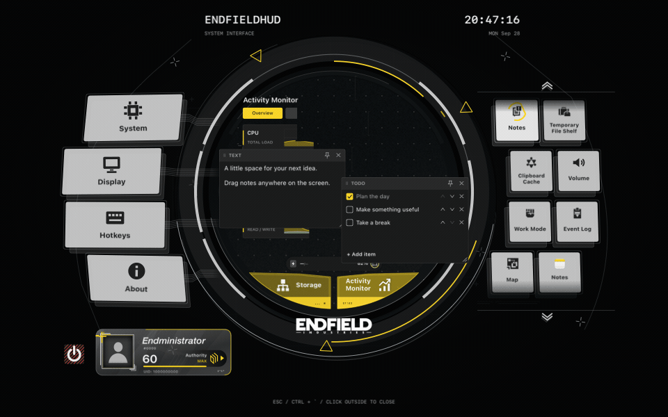

# EndfieldHUD

[English](README.md) · [简体中文](README.zh-CN.md) · [繁體中文](README.zh-TW.md) · [日本語](README.ja.md)

An Endfield-inspired menu bar app for macOS. Bring up a moving, layered HUD for notes, files, timers, audio controls, and a quick look at your Mac.

**Integration branch:** This branch combines the new Watch presentation with the stable 1.0.1 features and saved-data formats. To test this branch, open a successful [Build and test run for this branch](https://github.com/DDDuoDuo/EndfieldHUD/actions/workflows/build.yml?query=branch%3Acodex%2Fendfield-hud-integration) and download its **EndfieldHUD-macOS-…** artifact. The release download and previews below are for the stable version, not this branch.

**[Download v1.0.1 — EndfieldHUD-1.0.1-build11-macOS.dmg](https://github.com/DDDuoDuo/EndfieldHUD/releases/download/v1.0.1/EndfieldHUD-1.0.1-build11-macOS.dmg)** · [All releases](https://github.com/DDDuoDuo/EndfieldHUD/releases)

*All previews show the actual app with demo content and sample readings. They do not contain personal notes, clipboard history, or files.*

## Install

1. Download the DMG above. If an older copy is running, quit it from its menu bar menu.
2. Open the DMG and drag **EndfieldHUD.app** into **Applications**.
3. Eject the disk image, then open EndfieldHUD from Applications. Its icon appears in the menu bar.
4. Press **Ctrl + backtick (`)** to open the HUD.

This release is **ad hoc signed and not notarized by Apple**. If macOS blocks it because the developer cannot be verified, first try opening the installed app. If you trust this download, use **System Settings → Privacy & Security → Open Anyway** for EndfieldHUD, then confirm. Older macOS versions use **System Preferences → Security & Privacy**. This approves one app; do not disable Gatekeeper. See [Apple’s instructions](https://support.apple.com/102445).

The app is built for **Apple silicon with macOS 11+** and **Intel with macOS 10.15.4+**. Some features need newer macOS versions. Testing has focused on an M2 MacBook Air with macOS 15.7.4; other hardware and older systems have less coverage. [Compatibility details](docs/testing-build.md)

## Start here

- **Open or hide:** Ctrl + backtick, or the menu bar’s **Open overlay** item. Esc backs out of an edit or selection before closing the HUD.
- **Find a section:** use the side buttons; scroll the right-hand list to see more. Storage and Activity Monitor are below the center. Click the lower-left card for your profile.
- **Choose a language:** **System → Language** opens a checked selection list. Choose **System**, **English**, **简体中文**, **繁體中文**, or **日本語**. The four interface languages apply immediately; System follows macOS. [Preview](docs/media/languages.png)
- **Adjust the look:** Display controls size, position, color, theme, blur, perspective, and Reduce Motion. Hotkeys changes the summon shortcut.
- **Quit:** choose **Quit EndfieldHUD** from the menu bar, or click the red control beside the profile card and confirm. Hiding the HUD keeps the app running.

Watch opening, closing, tilt, and section changes

Opening, closing, and pointer tilt:

Moving between sections:

## What you can do

Click a preview to see that section. The linked guides have more detail.

| Section | What it does | Preview |
| --- | --- | --- |
| Power | Shows available battery and charging readings. Optional charging alerts appear outside the main HUD. | [Power](docs/media/overview.png) |
| [Notes](docs/notes-canvas.md) | Add text, checklists, and images. Move or resize cards; pin them across HUD sections. | [Notes](docs/media/notes.png) |
| [Temporary File Shelf](docs/file-shelf.md) | Drop files and folders in, preview them, then drag them out together. Removing a shelf entry keeps the original file. | [File shelf](docs/media/shelf.png) |
| [Clipboard Cache](docs/clipboard-cache.md) | Reuse recent text, links, images, and copied files. Pin useful entries. History is kept only until the app quits. | [Clipboard](docs/media/clipboard.png) |
| [Volume](docs/audio-and-work-mode.md) | Select audio devices and adjust supported volume, mute, and balance controls. Per-app volume is experimental and needs macOS 14.2+. | [Volume](docs/media/volume.png) |
| [Work Mode](docs/audio-and-work-mode.md#work-mode) | Run a countdown or stopwatch, with 5/30/60-minute presets and a custom duration. Timers continue while the HUD is hidden. | [Work Mode](docs/media/work-mode.png) |
| [Event Log](docs/event-log.md) | Browse and filter local HUD events, such as timer sessions, file-shelf actions, and device changes. | [Event Log](docs/media/event-log.png) |
| [Storage](docs/storage-and-activity.md#storage) | Check used and available space, refresh it, or open macOS Storage settings. | [Storage](docs/media/storage.png) |
| [Activity Monitor](docs/storage-and-activity.md) | View CPU, memory, network, and disk graphs, plus a sortable app list. Unavailable readings show a dash. | [Activity](docs/media/activity.png) |
| [+ Add App](docs/app-shortcuts.md) | Save shortcuts to installed apps with your own names and icons, then open them from the HUD. | [App shortcuts](docs/media/apps.png) |
| [Personal Profile](docs/personal-profile.md) | Edit your card’s name, portrait, background, introduction, and dates. See accumulated Work Mode time. | [Profile](docs/media/profile.png) |
| [Map](docs/map.md) | Pan and zoom an offline Earth map, and add your own pins. It does not use your location or load street maps. | [Map](docs/media/map.png) |
| System | Choose language, display, launch at login, and other behavior. | [Language selection](docs/media/languages.png) |
| Display | Change appearance, the app/menu bar icon, and battery alerts. Size and position changes have a timed undo. | [Settings](docs/media/settings.png) |
| Hotkeys | Record a new summon shortcut inside the HUD. | [Settings](docs/media/settings.png) |
| About | Check the version and credits, check for updates, or change automatic update installation. | [Settings](docs/media/settings.png) |

## Permissions and local data

| Feature | What it needs |
| --- | --- |
| Per-app volume | **macOS 14.2+** and **System Audio Recording** permission when you enable it. Audio is processed in memory, not saved. Device support is limited; see the [audio guide](docs/per-app-audio.md) and [Apple’s permission guide](https://support.apple.com/en-in/guide/mac-help/mchl2844ecab/mac). |
| Files and images | Access to items you choose, paste, or drop into the app. The shelf keeps file references; image notes and profile pictures keep local copies. |
| Update alerts | Optional notification permission. Update information is still available in the menu and About if notifications are denied. |
| Launch at login | Install in Applications first; macOS may ask you to approve it in Login Items. |
| Automatic Focus | This integration branch prefers Control Center with your **Accessibility** permission on **macOS 11+**, where its controls are recognized; configured Shortcuts on **macOS 13+** are a fallback. The stable v1.0.1 download requires those two user-created shortcuts. See [Focus setup](docs/audio-and-work-mode.md#automatic-focus-setup). The timer works without Focus automation. |

Notes, shelf references, profile, map pins, and event history stay on this Mac. Clipboard history stays in memory and clears on quit. Update checks and downloads contact GitHub; the app does not need an account. [Settings guide](docs/settings.md) · [Update guide](docs/updates.md)

## Project and credits

EndfieldHUD is an **unofficial fan project** by **DDDuoDuo**, inspired by *Arknights: Endfield*. It is not affiliated with or endorsed by the game’s creators.

Original code is under the [MIT license](LICENSE). Game artwork, branding, and other third-party material keep their own rights and licenses. See [Credits](CREDITS.md) for the visual references, artwork, map data, and dependencies.

[Report an issue](https://github.com/DDDuoDuo/EndfieldHUD/issues) · [Build and development](DEVELOPMENT.md) · [Testing notes](TESTING.md)
