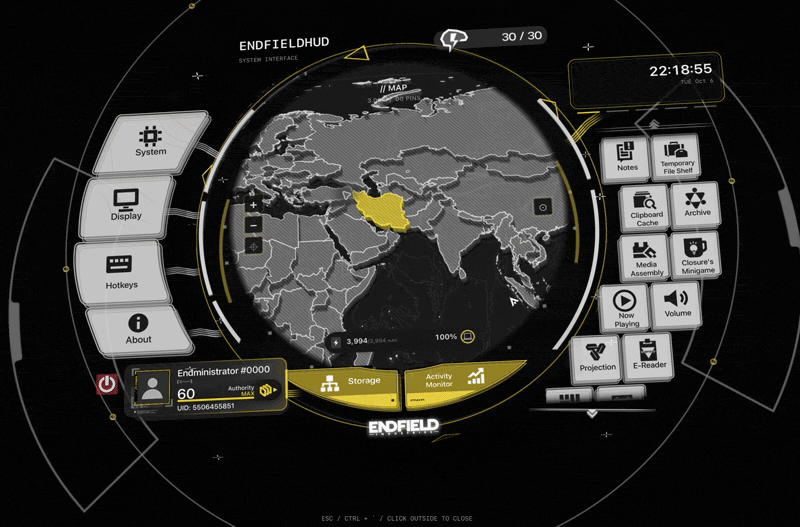

  
  
  

  <a href="README.md">English</a> · <a href="README.zh-CN.md">简体中文</a> · <a href="README.zh-TW.md">繁體中文</a> · <a href="README.ja.md">日本語</a>

A little bit of *Arknights: Endfield* on your Mac. Open a layered, animated HUD from the menu bar for notes, files, music, game stats, and everyday tools.

[Download PKG](https://github.com/DDDuoDuo/EndfieldHUD/releases/download/v1.2.0/EndfieldHUD-1.2.0-build17-Installer.pkg) · [Download DMG](https://github.com/DDDuoDuo/EndfieldHUD/releases/download/v1.2.0/EndfieldHUD-1.2.0-build17-macOS.dmg) · [All releases](https://github.com/DDDuoDuo/EndfieldHUD/releases)

0. If you have already installed a copy of EndfieldHUD, click **Check Update** button in the menu bar.
1. Open the DMG and drag **EndfieldHUD.app** into **Applications**, or run the PKG installer.
2. Open EndfieldHUD from Applications. Look for its icon in the menu bar.
3. Press **Ctrl + backtick (`)** to open the HUD. You can change the hotkey in **Hotkeys**.

If macOS blocks the app, go to **System Settings → Privacy & Security → Open Anyway**, then confirm. The app isn't notarized by Apple yet.

Use the side buttons to switch sections, and scroll the right side for more. **Esc** backs out of an edit before closing the HUD. Closing it keeps the app running; pressing the red power button allows you to quit this app.

Apple silicon: **macOS 11+**. Intel: **macOS 10.15.4+**. Some tools need a newer system or supported hardware.

Allow permissions when you use the features that need them:

| Permission | Used for |
| --- | --- |
| Accessibility | Letting Work Mode switch macOS Focus through Control Center. The timer works without it. |
| System Audio Recording | Experimental per-app volume on macOS 14.2+. Audio isn't saved. |
| Automation | Controlling supported music apps when macOS asks. |
| Notifications | Update alerts and calendar reminders. |
| Files and folders | Opening the files, pictures, and videos you choose. |

You can review permissions in **System Settings → Privacy & Security**; notifications have their own settings page.

| Tool | What you can do |
| --- | --- |
| Notes | Write, draw, make checklists, and add images or videos. Pin panels across sections. |
| Temporary File Shelf | Drop files in, preview them, and drag them back out. Originals stay where they are. |
| Clipboard | Scroll through recent copied text, links, images, and files. History clears when you quit. |
| Archive | Keep documents in your own categories, with rich text and media. |
| Reader | Read novels and PDFs, bookmark pages, and zoom in. |
| Media Assembly | Edit pictures and videos with cropping, adjustments, filters, and stickers. |
| Projection | Draw on a screen-sized canvas, with an optional dotted background. |
| Now Playing | See album art and available lyrics, and control playback. |
| Volume | Switch audio devices and adjust supported volume controls. |
| Work Mode & Calendar | Run a timer or stopwatch, and keep events with reminders. |
| Map & Minigame | Explore the offline terrain map and place pins, or play Merge! OrbiPom! |
| Personal ID & Account Binding | Customize your card. Link a game account for profile data and sanity countdowns. |
| Battery, Storage & Activity Monitor | Check charging status, disk space, CPU, RAM, and running apps. |
| App shortcuts | Add your apps with custom names and icons. |

Linking is optional.

In **Display**, change the theme, tilt, clock, icons, and animation settings. The HUD supports English, Simplified Chinese, Traditional Chinese, Japanese, and Korean.

Your notes and settings stay on your Mac. Linked community credentials use macOS Keychain. Updates come from GitHub; check the menu bar or **About** for update controls.

Made by [DDDuoDuo](https://github.com/DDDuoDuo). Inspired by *Arknights: Endfield* and [QinAnze’s charging concept](https://github.com/QinAnze/zmd-charge).

An unofficial fan project. Game artwork and branding belong to HYPERGRYPH and their respective owners. Original code is [MIT licensed](LICENSE); third-party assets and libraries keep their own terms. [Full credits and sources](CREDITS.md)

[Report a bug](https://github.com/DDDuoDuo/EndfieldHUD/issues)
