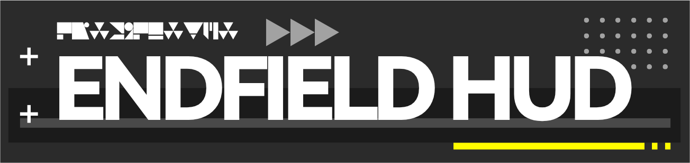
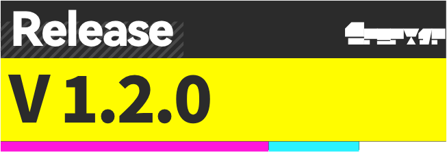
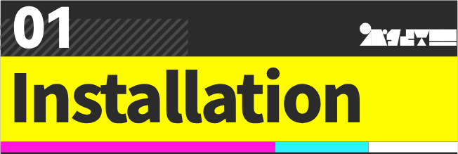
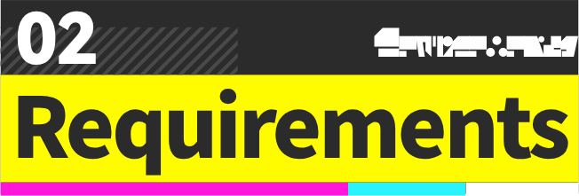
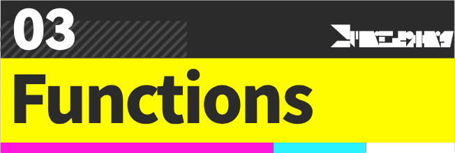
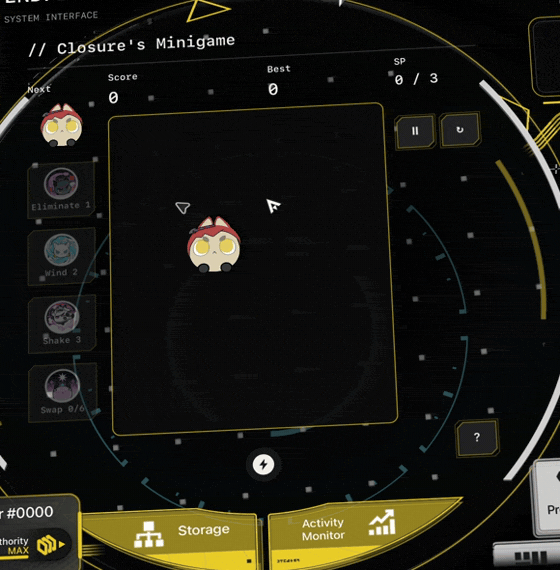
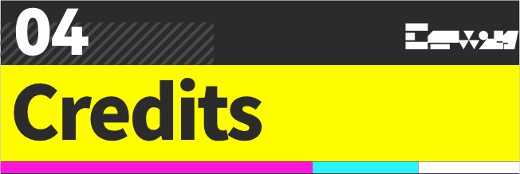

  
  
  

  <a href="README.md">English</a> · <a href="README.zh-CN.md">简体中文</a> · <a href="README.zh-TW.md">繁體中文</a> · <a href="README.ja.md">日本語</a>

給你的 Mac 加一點《明日方舟：終末地》的味道。按快速鍵或點選選單列，就能開啟有動畫和層次感的 HUD，寫便箋、放檔案、聽音樂、看遊戲資料，還有日常小工具。

[下載 PKG](https://github.com/DDDuoDuo/EndfieldHUD/releases/download/v1.2.0/EndfieldHUD-1.2.0-build18-Installer.pkg) · [下載 DMG](https://github.com/DDDuoDuo/EndfieldHUD/releases/download/v1.2.0/EndfieldHUD-1.2.0-build18-macOS.dmg) · [所有版本](https://github.com/DDDuoDuo/EndfieldHUD/releases)

0. 已經裝過 EndfieldHUD？在選單列點**檢查更新**就行。
1. 開啟 DMG，把 **EndfieldHUD.app** 拖進 **Applications（應用程式）**，也可以執行 PKG 安裝程式。
2. 從「應用程式」開啟 EndfieldHUD，選單列裡會出現它的圖示。
3. 按 **Ctrl + 反引號（`）** 開啟 HUD。想換快速鍵，可以到**快速鍵**裡改。

如果 macOS 擋住了 App，到**系統設定 → 隱私權與安全性 → 強制打開**，再確認一次。App 目前還沒有經過 Apple 公證。

用兩側按鈕切換功能，右側還能往下捲。**Esc** 會先離開編輯，再關閉 HUD。關閉 HUD 後 App 仍會執行；點紅色電源按鈕可以結束 App。

Apple 晶片：**macOS 11+**。Intel：**macOS 10.15.4+**。部分功能需要較新的系統或支援的硬體。

用到相關功能時，再允許它需要的權限：

| 權限 | 用來做什麼 |
| --- | --- |
| 輔助使用 | 讓工作模式透過控制中心切換 macOS 專注模式。不授權也能用計時器。 |
| 系統音訊錄製 | macOS 14.2+ 的實驗性個別 App 音量控制。不會儲存音訊。 |
| 自動化 | 在 macOS 提示時，允許控制支援的音樂 App。 |
| 通知 | 更新提醒和日曆提醒。 |
| 檔案與檔案夾 | 開啟你選擇的檔案、圖片和影片。 |

權限可以在**系統設定 → 隱私權與安全性**裡查看；通知有獨立的設定頁面。

| 工具 | 可以做什麼 |
| --- | --- |
| 便箋 | 寫字、畫畫、列待辦事項，還能加入圖片或影片。釘選面板後，切換功能也能看到。 |
| 檔案暫存架 | 拖入檔案、預覽，再拖出來。原始檔案還在原來的位置。 |
| 剪貼簿 | 捲動查看最近複製的文字、連結、圖片和檔案。結束 App 後清空記錄。 |
| 檔案庫 | 按自己的分類儲存文件，支援格式化文字和圖片、影片。 |
| 閱讀器 | 看小說和 PDF，加書籤，放大頁面。 |
| 影像加工 | 裁切、調整圖片和影片，加入濾鏡和貼紙。 |
| 投影 | 在全螢幕畫布上畫畫，也可以開啟點陣背景。 |
| 目前播放 | 看專輯封面和可用的歌詞，控制播放。 |
| 音量 | 切換音訊裝置，調整裝置支援的音量選項。 |
| 工作模式與日曆 | 用倒數計時或碼錶，記錄行程並設定提醒。 |
| 地圖與小遊戲 | 在離線地形圖上探索、放標記，或玩 Merge! OrbiPom!。 |
| 個人名片與帳號綁定 | 自訂名片，綁定遊戲帳號同步資料和理智倒數。 |
| 電源、儲存與活動監視器 | 查看充電狀態、磁碟空間、CPU、RAM 和執行中的 App。 |
| App 捷徑 | 加入自己的 App，自訂名稱和圖示。 |

帳號綁定是可選的。

在**顯示**裡可以改主題、傾斜、時鐘、圖示和動畫設定。HUD 支援英語、簡體中文、繁體中文、日語和韓語。

便箋和設定都留在你的 Mac 上。綁定後的社群憑證儲存在 macOS 鑰匙圈裡。更新來自 GitHub；選單列和**關於**裡都有更新選項。

由 [DDDuoDuo](https://github.com/DDDuoDuo) 製作。靈感來自《明日方舟：終末地》、[QinAnze](https://github.com/QinAnze/zmd-charge) 和 [llynxxx](https://www.bilibili.com/video/BV1DBaP6yEHs/)。

這是一個非官方同人專案。遊戲素材和品牌標誌歸鷹角網路及各自的權利人所有。原創程式碼採用 [MIT 授權](LICENSE)，第三方素材和函式庫保留各自的授權條款。[完整致謝與來源](CREDITS.md)

[回報問題](https://github.com/DDDuoDuo/EndfieldHUD/issues)
